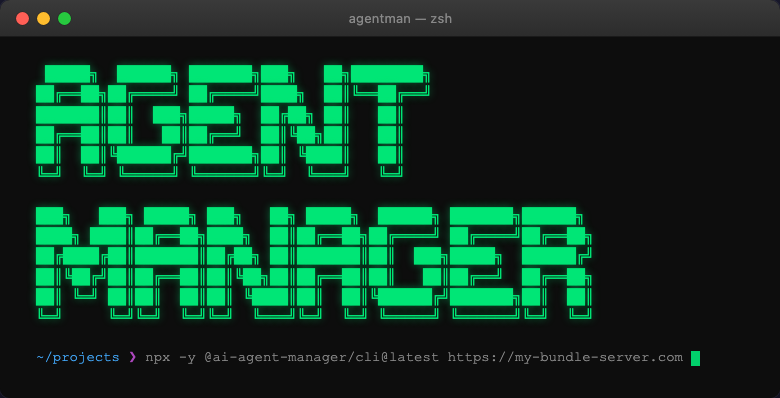

# Agent Manager



Your team has AI skills. This tool makes sure everyone's coding agent actually uses them.

Agent Manager pulls a versioned bundle of skills and Rovo agent configs from a URL you control, then installs them into Claude Code, Devin Desktop (formerly Windsurf), GitHub Copilot, or Cursor — interactively on a laptop, or silently in CI.

---

## Quick Start

```bash
npx -y @ai-agent-manager/cli@latest https://your-bundle-server.com
```

That's it. It fetches your team's discovery document, authenticates (if required), downloads the latest bundle, caches it at `~/.agentman/`, and opens an interactive menu.

---

## Why this exists

AI coding tools are only as useful as the skills they're given. Without a distribution mechanism, skills get shared in Slack, go stale, diverge per developer, and never make it into CI.

Agent Manager gives you a single source of truth for your team's agent skills — versioned, cacheable, and deployable anywhere Node runs.

---

## Requirements

- Node.js 22+
- Playwright _(optional — only needed for Rovo agent provisioning)_

---

## Usage

### Interactive (recommended for local use)

```bash
npx -y @ai-agent-manager/cli@latest <base-url>
```

Fetches `.well-known/agents/discovery.json` from your bundle server to discover available skills and authentication requirements, then downloads the latest bundle and opens the TUI.

### Headless (recommended for CI)

Skip the menu entirely with a config file:

```bash
npx -y @ai-agent-manager/cli@latest <source> --config .github/ai-skills.yml
```

The `<source>` can be a **bundle URL**, a **GitHub repository URL**, or a **local directory** — agentman detects the type automatically. Published artefacts (`.zip` URLs) are supported as sources within a [discovery document](docs/discovery.md).

**Config format:**

```yaml
tools: claude-code        # one or more: claude-code | windsurf (Devin Desktop) | github-copilot | cursor | kiro
scope: repo              # repo (default) | system
skills:
  - my-skill-name
bundle-version: 1.2.0   # optional — bundle sources only, omit to use latest
artefact-sha256: <hex>  # optional — artefact sources only, pins the expected zip hash
```

| Field | Required | Description |
|-------|----------|-------------|
| `tools` | Yes | AI coding tool(s) to install skills for |
| `scope` | No | `repo` installs into the current directory; `system` installs to the home directory |
| `skills` | Yes | Names of skills to install (matched by directory name) |
| `bundle-version` | No | Bundle sources only — pin to a specific version, or omit to track latest |
| `artefact-sha256` | No | Artefact sources only — expected SHA-256 of the zip; the install fails if the download doesn't match |

Skill names are matched against the skills resolved from all sources. Use the bare skill id when it's unambiguous. If two sources ship a skill with the same id, use the fully-qualified name instead:

```yaml
skills:
  - github.com/example-org/example-repo/my-skill   # qualified: org + repo + skill id
  - cdn.example.com/my-skill/my-skill               # qualified: host + artefact name + skill id
```

Unknown skill names log a warning and are skipped. Ambiguous bare names (matching skills from more than one source) log an error and cause the run to exit non-zero — use the qualified form to resolve the ambiguity. If no valid skills are found, the tool exits non-zero.

#### Install from a GitHub repository

Point agentman at any GitHub repository that contains skills under a `skills/` directory:

```
my-skills-repo/
  skills/
    my-skill/
      SKILL.md
    another-skill/
      SKILL.md
```

```bash
npx -y @ai-agent-manager/cli@latest https://github.com/org/my-skills-repo \
  --config .github/ai-skills.yml
```

For private repositories, set `GITHUB_TOKEN` to a personal access token with repo read access:

```bash
GITHUB_TOKEN=ghp_... npx -y @ai-agent-manager/cli@latest https://github.com/org/my-skills-repo \
  --config .github/ai-skills.yml
```

To pin to a specific branch or tag, use the `/tree/<ref>` GitHub URL format:

```bash
npx -y @ai-agent-manager/cli@latest https://github.com/org/my-skills-repo/tree/v2.0 \
  --config .github/ai-skills.yml
```

**GitHub Actions example:**

```yaml
- name: Install AI skills
  env:
    GITHUB_TOKEN: ${{ secrets.GITHUB_TOKEN }}
  run: |
    npx -y @ai-agent-manager/cli@latest https://github.com/org/my-skills-repo \
      --config .github/ai-skills.yml
```

#### Install from a published artefact (via discovery)

Artefacts (versioned `.zip` skill packages) are consumed through a [discovery document](docs/discovery.md) — you add an `artefact` source entry pointing to the zip URL, and agentman downloads and installs it during discovery resolution. **Artefacts are untrusted third-party packages** — review the source before adding it to your discovery document. See [docs/discovery.md](docs/discovery.md) for the full guide.

The version is resolved from the filename (`my-skill-1.2.0.zip`), the URL path, an embedded `manifest.json`, or — as a last resort — the content hash. The resolved version and source URL are pinned in the install record so the exact artefact can be reproduced and tracked later.

Integrity is verified against a `.sha256` sidecar published next to the zip (e.g. `my-skill-1.2.0.zip.sha256`). If no sidecar is found the download proceeds with a warning; if the hash doesn't match, the download is rejected. For an out-of-band pin that doesn't trust the artefact server, set `artefact-sha256` in `ai-skills.yml` — it takes precedence over the sidecar.

Artefact URLs must use `https://`. Plain `http://` is only accepted for localhost (local development against a mock server).

#### Install from a bundle server

```bash
npx -y @ai-agent-manager/cli@latest https://bundles.example.com \
  --config .github/ai-skills.yml
```

### Authentication

If your bundle server requires authentication, Agent Manager runs an interactive OAuth2/OIDC flow on first use:

1. A browser window opens to your provider's login page.
2. After login, a local callback server receives the authorization code.
3. Tokens are stored securely in `~/.agentman/auth/` and refreshed automatically when expired.

Tokens are stored on the filesystem with restrictive permissions (`0600`). See [docs/discovery.md](docs/discovery.md) for the full auth flow.

### Force re-download

Bypass the local cache and pull fresh content:

```bash
npx -y @ai-agent-manager/cli@latest <source> --update
```

### Help

```bash
npx -y @ai-agent-manager/cli@latest --help
```

---

## Interactive Menu

The TUI's top-level menu has these options:

- **My Projects** -- Shown when you are logged in, `api.features.projects` is `true`, and an API base URL is set (`api.baseUrl` in the discovery document, or `API_BASE_URL`). Lists the projects you can access; from a project you can Search & Install skills or provision Rovo agents, filtered by that project's catalogue allowlists.
- **Search & Install** -- Search a single catalogue of skills and Rovo agents, then act on your choice. Selecting a skill installs it (choose a source, scope, and coding tool); selecting a Rovo agent provisions it in Atlassian Studio. Rovo provisioning runs Playwright-driven browser automation from the command line by default; set `AGENTMAN_CHROME_EXTENSION=1` to also offer the Chrome Extension options, including direct extension installation (see [Feature Flags](#feature-flags)).
- **Maintenance & Updates** -- Bulk-sync a tool's skills (select the complete set for a tool; deselecting uninstalls), manage individual skill versions, manage installed skills (update/remove/inspect), manage cached bundle versions, and update the Agent Manager CLI itself.
- **Source Management** -- Install from a source URL: a GitHub repo, an artefact zip, or a bundle URL.
- **Settings & Config** -- Toggle startup update checks and telemetry, persisted to `~/.agentman/config.json`. Environment variables still take precedence.
- **Exit**

### Saved sources

Passing a source once saves it: `agentman <url>` resolves the source as before and also stores it, marking it the **active** source. A later bare `agentman` (no argument) resolves the active source, so you no longer need to paste the URL every time. Manage the saved list — add, remove, or pick which one is active — from **Source Management**. When a bare invocation runs, sources are tried in order (active first); a source that is unreachable is skipped so one dead source never blocks startup. Headless (`--config`) mode is unaffected: it always requires an explicit source argument and never falls back to saved sources, keeping CI runs reproducible.

On startup, if a newer app version or bundle is available, a bordered update panel appears above the menu. Press `U` to update the app, or `B` to pull the latest bundle immediately.

To suppress startup update checks:

```bash
AGENTMAN_DISABLE_STARTUP_UPDATE_CHECKS=1 npx -y @ai-agent-manager/cli@latest <base-url>
```

Or toggle it from **Settings & Config** in the menu, or set `"startupUpdateChecksDisabled": true` in `~/.agentman/config.json`.

---

## Supported Coding Tools

Skills are installed as symlinks into each tool's native skills directory:

| Tool | System-wide Path | Repo-scoped Path |
|------|-----------------|-----------------|
| Agents (Generic) | `~/.agents/skills/<skill>/` | `<repo>/.agents/skills/<skill>/` |
| Claude Code | `~/.claude/skills/<skill>/` | `<repo>/.claude/skills/<skill>/` |
| Cursor | `~/.cursor/skills/<skill>/` | `<repo>/.cursor/skills/<skill>/` |
| GitHub Copilot | `~/.copilot/skills/<skill>/` | `<repo>/.github/copilot/skills/<skill>/` |
| Kiro | `~/.kiro/skills/<skill>/` | `<repo>/.kiro/skills/<skill>/` |
| Devin Desktop (formerly Windsurf) | `~/.codeium/windsurf/skills/<skill>/` | `<repo>/.windsurf/skills/<skill>/` |

The link name depends on the install source:

- **HTTP sources declared in a discovery document** — namespaced by the declared source name: `<source-name>~<skill-id>/` (e.g. `team-skills~my-skill/`). The name, not the URL, is the namespace, so a source that moves or is republished elsewhere keeps the same install identity.
- **Repo and artefact sources** — namespaced: `<source>~<skill-id>/` (e.g. `github.com~example-org~example-repo~my-skill/` or `cdn.example.com~my-skill~my-skill/`). The prefix is derived from the source URL; every boundary — between namespace segments, and between the namespace and the skill id — is joined with `~`, a character the sanitiser never emits, so each `(source, skill-id)` pair maps to exactly one flat link name.
- **Local directory sources** — flat (bare `<skill-id>/`), and out of scope for the no-collision guarantee: same-id skills from two local bundles can still overwrite each other.

> **Windows note:** If symlink creation fails (requires admin rights or Developer Mode), the tool falls back to copying the skill directory instead.

### Repository-scoped installation

When you run Agent Manager from inside a git repo, the scope selector offers **System-wide** or **This repository**. Repo-scoped installs symlink from the shared bundle cache — the bundle itself isn't copied into the repo.

A `.agentman.json` file is written at the repo root tracking the pinned bundle version and installed skills. Commit this so everyone on the team stays in sync.

---

## How It Works

1. Agent Manager fetches a **discovery document** from `<base-url>/.well-known/agents/discovery.json` to learn about available skills and auth requirements.
2. If the server requires authentication, an OAuth2/OIDC flow runs interactively (PKCE, browser-based login).
3. Each source's bundle is downloaded and extracted under `~/.agentman/bundles/sources/<source-name>/<version>/`, so two sources publishing the same version number stay separate. A bundle fetched from a bare URL rather than a declared source still lands in the older `~/.agentman/bundles/<version>/` layout.
4. `~/.agentman/current` symlinks to the active version of that older layout, and **Maintenance & Updates → Manage Bundle Versions** operates on it. Source-scoped bundles are not yet covered by either.
5. Multiple bundle versions coexist on disk.
6. Installing a skill symlinks the entire skill directory from the cache into the target tool's skills path.
7. Installation state is tracked in `~/.agentman/config.json` (system-wide) or `.agentman.json` (repo-scoped).

---

## Bundle Format

The discovery document at `<base-url>/.well-known/agents/discovery.json` declares skill sources (git repos, HTTP bundles, or artefact zips). Each HTTP source declares a **content root**, and its bundles live at `<content-root>/<version>/bundle.zip`. See [docs/discovery.md](docs/discovery.md) for the discovery document spec and [docs/bundle-format.md](docs/bundle-format.md) for the zip contents.

---

## Examples Folder

The [examples/](examples/) directory contains sample assets used for reference, local testing, and smoke tests.

- `examples/epic-elaboration-agent/` -- Example Rovo agent used by the live test helper script (`scripts/test-rovo-live.ts`).
- `examples/story-build-readiness-agent/` -- Additional example Rovo agent manifest for authoring and testing patterns.
- `examples/git-skill-importer/` -- End-to-end example for git skill discovery; exercised in CI.

Important behavior:

- These examples are repository-local fixtures. They are not automatically used when you run Agent Manager against a remote bundle URL.
- In normal production usage, Agent Manager pulls agents from the content root each source declares in the discovery document.
- To use local examples directly, run Agent Manager with a local directory source instead of a remote URL.

---

## Telemetry

Agent Manager can send a small set of anonymous usage events to help understand adoption and catch operational failures. Telemetry is opt-in, based on your bundle server. No prompts, skill content, repo names, file paths, or personal identifiers are ever sent. Telemetry is automatically disabled in CI.

See [docs/telemetry.md](docs/telemetry.md) for the full event list and instructions to disable or override the endpoint.

---

## Feature Flags

| Variable | Default | Description |
|----------|---------|-------------|
| `AGENTMAN_CHROME_EXTENSION` | off | Expose the Chrome Extension provisioning path under **Rovo Agents**. When off, Playwright CLI automation is used directly. |

```bash
AGENTMAN_CHROME_EXTENSION=1 npx -y @ai-agent-manager/cli@latest <base-url>
```

---

## Development

```bash
npm install          # install dependencies
npm run dev -- <url> # run locally against a bundle server
npm run build        # compile to dist/
npm test             # run tests once
npm run test:watch   # watch mode
npm run typecheck    # type check without emitting
```

### Mock HTTP skills server

Integration tests and local dev can run against a local mock of the agent CDN using [Imposter](https://docs.imposter.sh):

```bash
cd mocks
imposter up             # starts on http://localhost:8080
imposter down -a        # stop when done
```

Then run against the mock for a local integration test:

```bash
npm run dev -- http://localhost:8080
```

---

## Publishing

CI publishes automatically on version tags. See [docs/publishing.md](docs/publishing.md) for tag conventions, required secrets, manual publish steps, and beta/prerelease instructions.

---

## Contributing

Bug reports, fixes, and features are all welcome. See [CONTRIBUTING.md](CONTRIBUTING.md) for commit conventions, branch naming, and how to get a dev environment running.